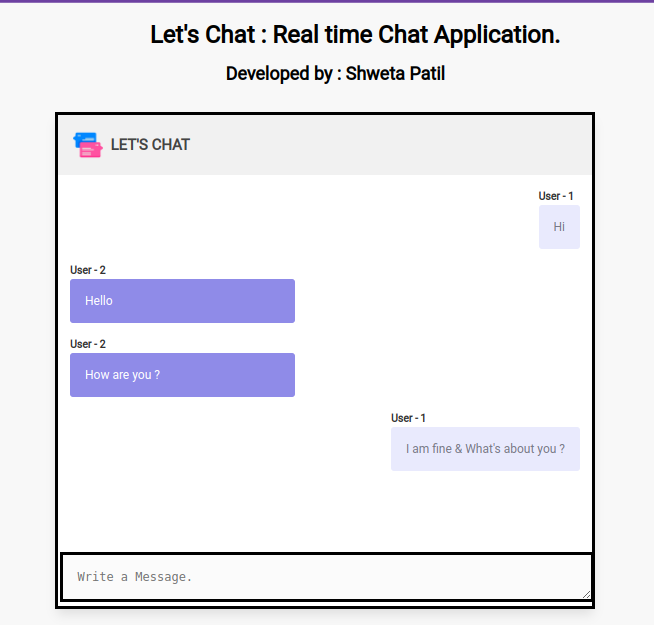

  <a href="https://github.com/othneildrew/Best-README-Template">  
    
  </a>
  
  <a href="http://real-time-lets-chat-app.herokuapp.com/" target=”_blank”><strong>Let's Chat»</strong></a>
  <h3 align="center">Simple Real-time Chat Application</h3>
   
  
  
  
  
